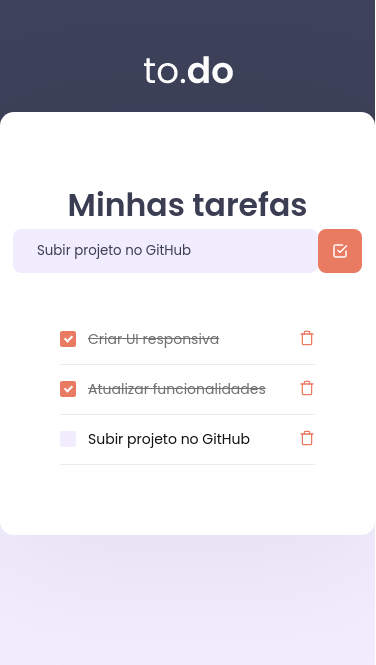
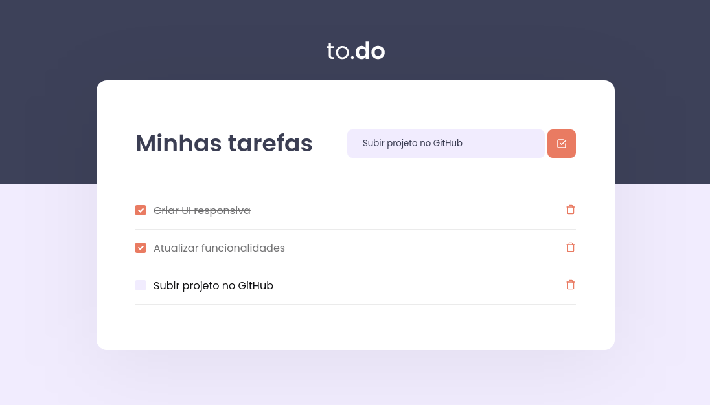

# to.do Task Manager

## React Web Application for a to-do list.

---

 
Esse projeto é resultado do primeiro desafio na trilha de ReactJS no curso Ignite da @Rocketseat. Nele utilizei Hooks para controlar o state dos elementos, adicionando, removendo e marcando as tarefas prontas.
 
 
Tomei liberdade e alterei o CSS para melhor responsividade em aparelhos pequenos e troquei a paleta de cores para tons mais suaves e agradáveis. Não acho que uma lista de tarefas precisa de cores agressivas.
 
 

## [Link da aplicação]()

 
 
 

---

 
This Project is result of the first challenge in ReactJs course from @Rocketseat's Ignite. In this project I have used hooks to manage the tasks state, adding, removing and checkign done tasks.
 
 
I changed the CSS for better responsivity in small devices and change de color palette to something more pleasing and less contrasting, I don't think a task list UI should have agressive colors.
 
 

## [App Link]()

## Social Links

[Linkedin](https://www.linkedin.com/in/marcellolopes30/)
 
[Rocketseat](https://app.rocketseat.com.br/me/marcello-lopes-03897)
